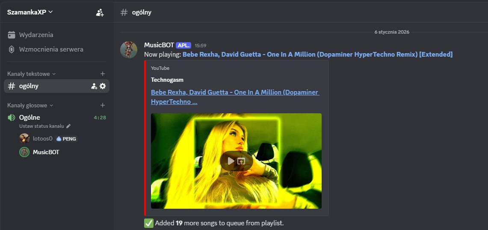

# Discord Music Bot 🎶

A lightweight Discord music bot written in **Python 3.11+** using [discord.py](https://github.com/Rapptz/discord.py), [yt-dlp](https://github.com/yt-dlp/yt-dlp) and **FFmpeg**.  
Plays music from YouTube (single songs and playlists), manages a per-guild queue, and supports basic playback commands.

---

## 🌐 Related Projects

- **Kubernetes manifests** -> [discord-bot-k8s](https://github.com/lotoos0/discord-bot-k8s)  
- **Terraform AWS EC2** -> [discord-bot-terraform](https://github.com/lotoos0/discord-bot-terraform)
- **Monitoring stack (Prometheus, Alertmanager, Grafana, Discord Alerts)** -> [discord-bot-monitoring](https://github.com/lotoos0/discord-bot-monitoring)

---




---

## ✨ Features

### Core Functionality
- Slash commands (`/play`, `/add`, `/queue`, `/skip`, `/shuffle`, `/remove`, `/clearqueue`, `/join`, `/leave`)
- Play both **single YouTube links** and **playlists** (max 20 items)
- **Per-guild queues** (each server has its own independent queue)
- **Auto-reconnect for FFmpeg streams** to handle YouTube resets
- **Auto-disconnect when alone** - Bot leaves voice channel when no users remain
- **Shuffle queue** - Randomize song order
- **Remove songs** - Delete specific songs from queue by position
- Error handling for broken/removed videos (skipped gracefully)
- Environment variable for Discord token (`DISCORD_TOKEN`)

### Performance & Stability
- **Instant queue display** - No external API calls, shows full YouTube URLs in markdown
- **Background playlist loading** - First song plays immediately, rest loads in background
- **Task tracking** - Prevents overlapping playlist loads on same guild
- **Queue size limit** - Max 100 songs per guild to prevent memory issues
- **Smart error handling** - Skips unavailable videos without breaking playlists
- **Race condition prevention** - Uses asyncio.Lock to prevent duplicate disconnect messages

### Developer Experience
- **Comprehensive logging** - Structured logging with timestamps and log levels
- **Automatic cleanup** - Event-driven cleanup when bot leaves voice channels
- **Error handling** - Full try/except coverage with detailed error messages
- **Type hints** - Complete type annotations for better IDE support
- **Async/await** - Non-blocking codebase prevents event loop delays

---

## 🚀 Getting Started

### Requirements
- Python **3.11+**
- [FFmpeg](https://ffmpeg.org/download.html) (must be installed and available in `PATH`)
- [Opus](https://opus-codec.org/) libraries (e.g. `libopus0` on Debian/Ubuntu)
- Discord bot token from [Discord Developer Portal](https://discord.com/developers/applications)

### Local Installation

1. **Clone the repository**
```bash
git clone https://github.com/your-username/discord-bot.git
cd discord-bot
```

2. **Install Python dependencies**
```bash
pip install -r requirements.txt
```

3. **Set up environment variables**
```bash
# Create .env file
echo "DISCORD_TOKEN=your_discord_bot_token_here" > .env
```

4. **Run the bot**
```bash
python main.py
```

---

## 🐳 Running with Docker

Build and run the bot inside a container:

```bash
docker build -t discord-music-bot .
docker run --rm --env-file .env discord-music-bot
```

Dependencies like ffmpeg and libopus are already included in the Dockerfile.

---

## ⚙️ Commands

- ```/join``` → Bot joins your current voice channel
- ```/leave``` → Bot leaves the voice channel
- ```/play <url>``` → Join voice channel and start playing music (URL or playlist)
    - Automatically joins VC if not connected
    - First item in a playlist starts **immediately**
    - Remaining items are processed in the **background** (non-blocking)
- ```/add <url>``` → Add music to existing queue (bot must already be playing)
    - Clearer UX alternative to `/play` when bot is already active
- ```/queue``` → Display the current queue (max 20 items)
- ```/skip``` → Skip the currently playing track
- ```/shuffle``` → Shuffle the queue randomly
- ```/remove <position>``` → Remove a specific song from queue (1-indexed)
- ```/clearqueue``` → Clear the entire queue

---

## 🏗️ Architecture

### Design Patterns
- **Async/Await First** - Non-blocking event loop, prevents freezing
- **Per-Guild Isolation** - Each server has independent queues and state
- **Event-Driven Cleanup** - Automatic state cleanup via `on_voice_state_update` event
- **Task Tracking** - Prevents concurrent playlist loads on same guild
- **Code Reusability** - Shared logic via `_handle_music_request()` helper

### Key Components

| Component | Purpose |
|-----------|---------|
| `YTDLSource` | Audio stream wrapper for discord.py |
| `_handle_music_request()` | Shared logic for `/play` and `/add` commands |
| `play_next()` | Queue playback handler with auto-retry and timeout |
| `on_voice_state_update()` | Automatic guild cleanup on bot disconnect |
| `cleanup_guild()` | Task cancellation & state reset |

---

## 📊 Logging & Monitoring

The bot includes **structured logging** with timestamps and log levels:

```
[2025-12-27 12:34:56] INFO - __main__: Logged in as MusicBot#1234
[2025-12-27 12:35:01] INFO - __main__: Playlist queued in guild 123456789. First song added, processing 19 more in background.
[2025-12-27 12:35:05] INFO - __main__: Now playing in guild 123456789: Song Title
```

**Log Levels:**
- `INFO` - Normal operations (commands, playback, connections)
- `WARNING` - Non-critical issues (skipped videos, disconnections)
- `ERROR` - Exceptions with full stack traces for debugging

---

## TODO

### Planned Features
- `/pause` - Pause current playback
- `/resume` - Resume paused playback
- `/nowplaying` - Show current track + progress bar
- `/search <query>` - Search YouTube and add to queue


**Built with ❤️ for my besties on the server!**

_Last updated: January 6, 2026_
