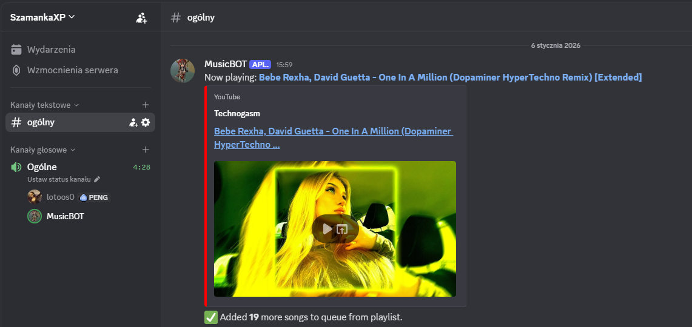

# Discord Music Bot

A compact Discord music bot written in Python 3.11+ with `discord.py`, `yt-dlp`, and FFmpeg.

It plays YouTube links and playlists, keeps queues isolated per guild, loads playlist entries in the background, and handles common disconnect/cleanup cases automatically.

## Related Projects

- Kubernetes manifests: [discord-bot-k8s](https://github.com/lotoos0/discord-bot-k8s)
- Terraform AWS EC2: [discord-bot-terraform](https://github.com/lotoos0/discord-bot-terraform)
- Monitoring stack: [discord-bot-monitoring](https://github.com/lotoos0/discord-bot-monitoring)



## Features

- Slash commands for joining, leaving, playback, queue viewing, skipping, shuffling, removing, and clearing the queue
- Per-guild queues and playback state
- Background playlist loading: the first song starts first, the rest of the playlist is queued afterward
- Queue size limit of 100 songs per guild
- Playlist extraction limited to the first 50 items
- Guarded voice connection flow for joining and moving between channels
- Automatic cleanup when the bot leaves voice or stays alone in a voice channel
- Queue clearing also stops in-progress background playlist loading
- Structured logging for runtime diagnostics


## Requirements

- Python 3.11+
- [FFmpeg](https://ffmpeg.org/download.html) available in `PATH`
- [Opus](https://opus-codec.org/) libraries for Discord voice support
- A Discord bot token from the [Discord Developer Portal](https://discord.com/developers/applications)

## Setup

1. Clone the repository:

```bash
git clone https://github.com/your-username/discord-bot.git
cd discord-bot
```

2. Install dependencies:

```bash
pip install -r requirements.txt
```

3. Create a local `.env` file:

```bash
DISCORD_TOKEN=your_discord_bot_token_here
```

4. Run the bot:

```bash
python main.py
```

On Windows you can also start it with:

```bat
start-bot.bat
```

## Docker

Build and run the bot in Docker:

```bash
docker build -t discord-music-bot .
docker run --rm --env-file .env discord-music-bot
```

The image already includes FFmpeg and the required voice libraries.

## Commands

- `/join` - Join your current voice channel, or move there if already connected elsewhere
- `/leave` - Leave the current voice channel
- `/play <url>` - Join voice if needed and start playback from a YouTube URL or playlist
- `/add <url>` - Add a URL or playlist to the existing queue
- `/queue [page]` - Show the current queue, 20 songs per page
- `/skip` - Skip the currently playing song
- `/shuffle` - Shuffle the current queue
- `/remove <position>` - Remove one queued song by 1-based position
- `/clearqueue` - Clear the queue and stop background playlist loading for that guild

## Project Structure

- `main.py` - Discord client startup and slash-command definitions
- `music_service.py` - Playback flow, queue orchestration, disconnect handling, and shared command logic
- `music_audio.py` - `yt-dlp` extraction, FFmpeg source creation, and queue/playlist rendering helpers
- `music_state.py` - Per-guild queues, loading flags, task tracking, text channels, and disconnect locks

## Notes

- The bot reads `DISCORD_TOKEN` from the environment.
- If `cookies.txt` exists locally or in `/app/cookies.txt`, `yt-dlp` will use it automatically.
- Logs use standard Python logging with timestamps and log levels.
