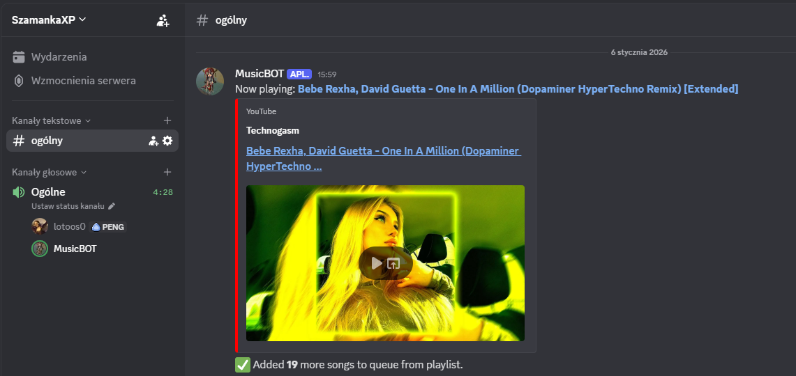
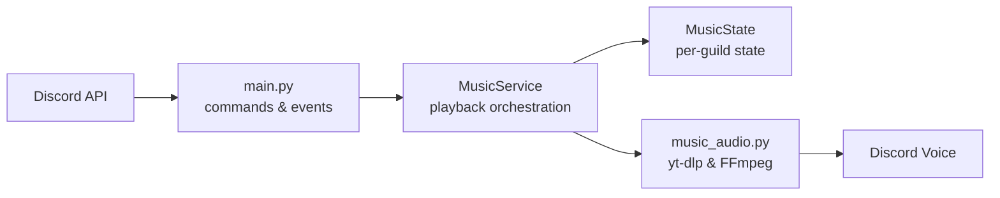

# Discord Music Bot

A multi-guild Discord music bot built with Python, `discord.py`, `yt-dlp`, and FFmpeg, with isolated per-guild playback state, asynchronous playlist processing, automatic voice cleanup, and Docker-based deployment.

[](https://github.com/lotoos0/discord-bot/actions/workflows/ci.yml)




## Overview

Discord Music Bot is a voice playback service designed to handle multiple Discord guilds independently.

Each guild maintains its own queue and playback state. The bot manages the voice connection lifecycle, processes playlists in the background, handles queue operations, and cleans up automatically when a voice session ends.

The project is also the application layer of a larger deployment stack covering Docker, Kubernetes, Terraform, and monitoring.

## Key Features

- YouTube video and playlist playback
- Multi-guild playback with independent queues
- Queue management: add, remove, shuffle, skip, and clear
- Automatic voice connection and cleanup
- Background playlist loading
- Docker-ready runtime

## Architecture


```mermaid
flowchart LR
    Discord[Discord API]
    Main["main.py<br/>commands & events"]
    Service["MusicService<br/>playback orchestration"]
    State["MusicState<br/>per-guild state"]
    Audio["music_audio.py<br/>yt-dlp & FFmpeg"]
    Voice[Discord Voice]

    Discord --> Main
    Main --> Service
    Service --> State
    Service --> Audio
    Audio --> Voice
```

- `main.py` owns Discord startup, events, and slash commands.
- `MusicService` coordinates playback and voice-session lifecycle.
- `MusicState` keeps mutable state isolated between guilds.
- `music_audio.py` handles media extraction and FFmpeg audio sources.

## Engineering Highlights

### Per-guild isolation

Queues, playlist loading, and playback state are maintained independently for every Discord guild, preventing one server from affecting another.

### Voice lifecycle management

Connection, channel switching, disconnect handling, and cleanup are centralized in the service layer instead of being spread across slash commands.

### Background work

Playlist entries are processed asynchronously so large playlists do not block Discord command handling.

### Container security

The Docker image runs the application as a non-root user and includes the native FFmpeg and voice dependencies required at runtime.

## Commands

| Command | Description |
| --- | --- |
| `/join` | Join your current voice channel, or move there if already connected elsewhere |
| `/leave` | Leave the current voice channel |
| `/play <url>` | Join voice if needed and start playback from a YouTube URL or playlist |
| `/add <url>` | Add a URL or playlist to the existing queue |
| `/queue [page]` | Display the current queue |
| `/skip` | Skip the currently playing song |
| `/shuffle` | Shuffle the current queue |
| `/remove <position>` | Remove one queued song by 1-based position |
| `/clearqueue` | Clear the queue and stop background playlist loading |

## Quick Start

### Local

```bash
git clone https://github.com/lotoos0/discord-bot.git
cd discord-bot

python -m venv .venv
```

Linux/macOS:

```bash
source .venv/bin/activate
```

Windows:

```powershell
.venv\Scripts\activate
```

Install dependencies and configure the token:

```bash
pip install -r requirements.txt
```

Create a local `.env` file:

```bash
DISCORD_TOKEN=your_discord_bot_token_here
```

Run the bot:

```bash
python main.py
```

On Windows you can also start it with:

```bat
start-bot.bat
```

### Docker

```bash
docker build -t discord-music-bot .
docker run --rm --env-file .env discord-music-bot
```

The image includes FFmpeg, Opus, and Sodium dependencies and runs the bot as an unprivileged user.

## Testing

Run the unit test suite with:

```bash
python -m unittest -v
```

The tests cover core playback orchestration, per-guild state management, queue behavior, cleanup paths, and audio helper logic.

## CI/CD

GitHub Actions validates every push and pull request through:

1. import-order validation with `isort`
2. formatting validation with `black`
3. static analysis with `pylint`
4. unit tests

Successful pushes to `main` additionally build and publish versioned Docker images to Docker Hub.

## Deployment Ecosystem

```text
discord-bot
    │
    ├── discord-bot-k8s
    │       Kubernetes deployment
    │
    ├── discord-bot-terraform
    │       AWS infrastructure
    │
    └── discord-bot-monitoring
            Observability stack
```

- Kubernetes manifests: [discord-bot-k8s](https://github.com/lotoos0/discord-bot-k8s)
- Terraform AWS EC2: [discord-bot-terraform](https://github.com/lotoos0/discord-bot-terraform)
- Monitoring stack: [discord-bot-monitoring](https://github.com/lotoos0/discord-bot-monitoring)

## Project Structure

- `main.py` - Discord client startup and slash-command definitions
- `music_service.py` - Playback flow, queue orchestration, disconnect handling, and shared command logic
- `music_audio.py` - `yt-dlp` extraction, FFmpeg source creation, and queue/playlist rendering helpers
- `music_state.py` - Per-guild queues, loading flags, task tracking, text channels, and disconnect locks
- `tests/` - Unit tests for the service, state, and audio-helper modules

## Operational Limits

- Maximum queue size: 100 tracks per guild
- Maximum playlist extraction: 50 entries
- Queue display: 20 entries per page
- Playback sources currently target YouTube URLs
- Optional `cookies.txt` can be used by `yt-dlp` if present locally or at `/app/cookies.txt`

## Notes

- The bot reads `DISCORD_TOKEN` from the environment.
- Logs use standard Python logging with timestamps and log levels.

## License

Distributed under the [MIT License](LICENSE).
